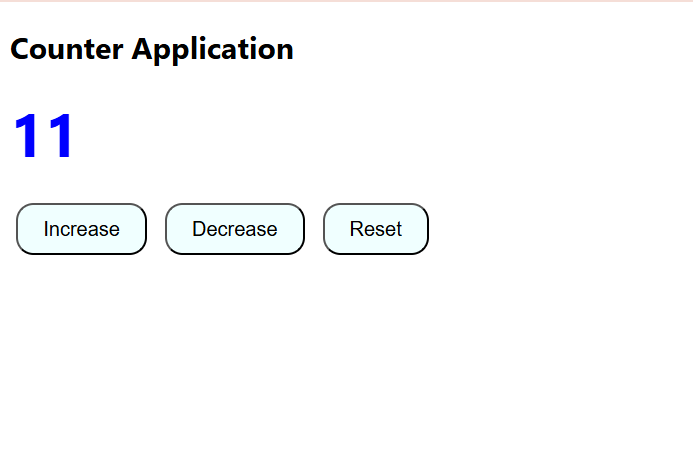

# 🧮 Counter App

A simple **Counter Application** built using **HTML**, **CSS**, and **JavaScript**.  
This project was created as part of my learning journey in JavaScript DOM manipulation.

---

## 📌 Project Features
- Increase, decrease, and reset counter value.
- Dynamic color change:
  - **Blue** for positive numbers.
  - **Red** for negative numbers.
  - **Black** for zero.
- Fully responsive and clean UI.

---

## 🎯 What I Learned
- How to use **DOM selection methods** (`getElementById`).
- Adding **event listeners** for button clicks.
- Writing a reusable **update function** for UI changes.
- Changing CSS styles dynamically using JavaScript.
- Basic **HTML structure** and **CSS styling**.

---

## 🖼 Preview



---


## 📂 Project Structure
```plaintext
counter-app/
│── index.html      # HTML structure
│── style.css       # Styling for the counter
│── script.js       # JavaScript logic

---


